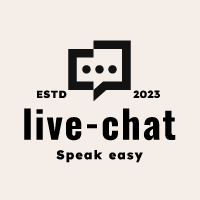

  

    
  

  
# Live Chat

An intuitive and real-time chat application that allows users to communicate instantly.

## Introduction

Live Chat is a real-time messaging application designed to provide a seamless communication experience. Built with a focus on speed and simplicity, Live Chat allows users to sign up, log in, and start conversing immediately without any hassle.

This project is crafted to demonstrate the ability to create a full-fledged chat application that can be scaled and integrated into any system requiring real-time communication.

Experience Live Chat in action: [Live Chat Application](https://live-chat-2ecc8.web.app/)

## Features

- Real-time messaging: Send and receive messages instantly without any delay.
- User authentication: Secure signup and login process.
- Persistent messages: Messages are saved and will persist between sessions.
- Modern UI: A clean and intuitive user interface for easy navigation and use.
- Privacy-focused: Designed with privacy in mind; no tracking or analytics.

## Tech Stack

- [Vue.js](https://vuejs.org/) - The Progressive JavaScript Framework for building user interfaces.
- [Firebase](https://firebase.google.com/) - Backend-as-a-Service for authentication, database (Firestore), and hosting.

## Support
If you find this project useful, please consider supporting it by buying me a coffee!
https://www.buymeacoffee.com/givemerasp2

## License
Live Chat is open source software licensed as MIT.
